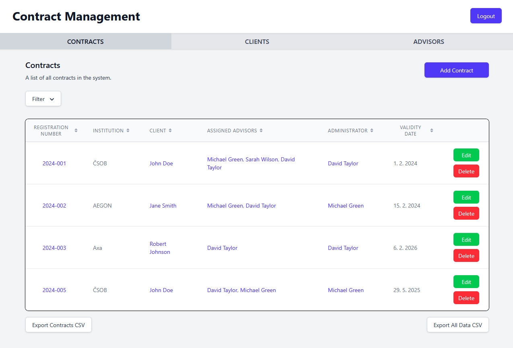
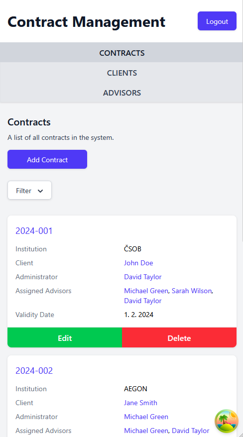

# Contract Management POC

A proof-of-concept React application for managing contracts, clients, and advisors. Built with React, TypeScript, React Hook Form, Zod, and json-server for a mock API.

This project demonstrates core CRUD functionalities, form validation, many-to-many relationships, role-based access, and responsive design, along with several added features like enhanced validation, duplicate checks, improved table interactions, and comprehensive CSV export capabilities.

---

## Documentation

- [User Guide](USER_GUIDE.md): Learn how to use the application, including placeholder accounts and features.
- [Technical Documentation](TECHNICAL_DOCS.md): Get an in-depth understanding of the project's tech stack, structure, APIs, and development details.

### Desktop UI:

   

### Mobile UI:

   

## License

This is a proof-of-concept project for demonstration purposes.